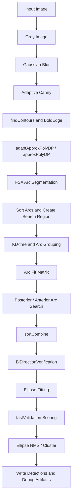

# classic-ellipse-detector 项目侦察报告

生成时间：2026-05-30

## 1. 项目结构摘要

项目根目录：

```text
E:\scc_desk\Net\classic-ellipse-detector
```

当前项目是一个 C++17 / OpenCV 版本的 AAMED 椭圆检测 baseline 工程，主要由单图检测程序和评估程序组成。

关键目录与文件：

| 路径 | 作用 |
| --- | --- |
| `README.md` | 项目构建、检测和评估说明 |
| `CMakeLists.txt` | CMake 构建配置，生成 `aamed_demo` 和 `aamed_eval` |
| `src/main.cpp` | 单图检测入口，解析 `--input`、`--output-dir`、`--export-debug` 等参数 |
| `src/FLED.cpp` | baseline 检测主流程，核心函数为 `FLED::run_FLED` |
| `src/Segmentation.cpp` | FSA 弧段分割、弧段排序等逻辑 |
| `src/Group.cpp` | 弧段搜索、组合和双向验证 |
| `src/Validation.cpp` | 椭圆验证、候选打分、候选聚类 |
| `src/EllipseNonMaximumSuppression.cpp` | 椭圆 NMS |
| `src/FLED_Export.cpp`、`src/FLED_drawAndWriteFunctions.cpp` | 检测结果、调试图、耗时和 `.fled.txt` 输出 |
| `tools/aamed_eval.cpp` | 检测结果评估工具 |
| `data/` | 单图示例数据 |
| `datasets/prasad/` | Prasad 数据集和已有 AAMED 结果 |
| `scc_doc/` | 本轮侦察与实验文档输出目录 |

可以安全新增文件的位置：

```text
scc_doc/
scc_doc/logs/
scc_doc/figures/
```

后续如果进入最小实现阶段，建议优先新增独立实验目录，例如：

```text
scc_experiments/
```

## 2. baseline 运行方式

README 中推荐的 CMake 构建方式：

```powershell
cmake -S . -B build -G "MinGW Makefiles" -DOpenCV_DIR="<OpenCV_DIR>"
cmake --build build
```

本机侦察结果：

- `cmake` 当前不在 PATH 中，直接运行 `cmake --version` 失败。
- `g++` 可用，但本机 OpenCV 是 VS/VC16 版本，不适合直接用 MinGW 链接。
- `cl` 可用，但普通 PowerShell 未加载 MSVC 标准库 include 路径。
- 使用 Visual Studio 2022 Community 的 `VsDevCmd.bat` 后，MSVC 编译可用。
- 本机 OpenCV 路径为：

```text
E:\OPENCV\opencv\build
```

本轮实际使用 MSVC 手工编译出：

```text
build\bin\aamed_demo.exe
build\bin\aamed_eval.exe
```

编译期间只出现 OpenCV 头文件代码页警告 `warning C4819`，未发现源码编译错误。

## 3. baseline 算法流程

根据 `src/main.cpp` 和 `src/FLED.cpp::run_FLED`，baseline 主流程如下：



对应代码位置：

| 流程阶段 | 代码位置 |
| --- | --- |
| 图像读取、灰度转换、参数设置 | `src/main.cpp` |
| 高斯滤波、自适应 Canny、轮廓提取 | `src/FLED.cpp::run_FLED` |
| 弧段分割 | `src/Segmentation.cpp::FSA_Segment` |
| 弧段排序、搜索区间、KD-tree | `src/FLED.cpp::run_FLED` |
| 弧段组合 | `src/FLED.cpp::Arcs_Grouping`、`src/Group.cpp` |
| 弧段拟合矩阵 | `src/FLED_PrivateFunctions.cpp::GetArcMat` |
| 候选生成与双向验证 | `src/Group.cpp::BiDirectionVerification` |
| 椭圆拟合 | `src/FLED.cpp::FittingConstraint`、`src/FLED.cpp::fitEllipse` |
| 椭圆验证与评分 | `src/Validation.cpp::fastValidation` |
| NMS / 聚类 | `src/EllipseNonMaximumSuppression.cpp` 或 `src/Validation.cpp::ClusterEllipses` |
| 输出 `.fled.txt`、表格、调试图 | `src/FLED_Export.cpp`、`src/FLED_drawAndWriteFunctions.cpp` |

`src/main.cpp` 中 baseline 参数为：

```cpp
aamed.SetParameters(CV_PI / 3, 3.4, 0.77);
```

## 4. 数据集结构

### 4.1 单图示例数据

```text
data/
  imagenames.txt
  images/
    002_0038.jpg
  gt/
    002_0038.jpg.txt
```

`data/imagenames.txt` 当前只有 1 张图：

```text
002_0038.jpg
```

示例 GT 文件格式：

```text
1
119.135 120.578 93.5035 94.4265 0.439749667673987
```

格式含义：

```text
第一行：GT 椭圆数量
后续每行：cx cy a b theta_rad
```

### 4.2 Prasad 数据集

```text
datasets/prasad/
  imagenames.txt
  images/
  gt/
  AAMED/
```

侦察结果：

| 项目 | 数量 / 说明 |
| --- | --- |
| `imagenames.txt` | 198 行 |
| `images/` | 198 张图 |
| `gt/` | 198 个 GT 文件 |
| `AAMED/` | 198 个已有 `.fled.txt` 结果文件 |
| GT 文件名前缀 | `gt_`，例如 `gt_002_0038.jpg.txt` |
| GT 格式 | 与 `--gt-format plain_rad` 兼容 |

当前未发现 train / val / test 划分文件。项目默认单图输入为：

```text
data/images/002_0038.jpg
```

Prasad 全集若要重新跑 detector，需要新增批量运行 wrapper；当前原始 `aamed_demo` 只支持单图输入。

## 5. 评估脚本位置与输入格式

评估工具：

```text
tools/aamed_eval.cpp
build\bin\aamed_eval.exe
```

评估输入：

- `--dataset-root`：自动读取 `<dataset-root>/imagenames.txt` 和 `<dataset-root>/gt`
- `--results-dir`：检测结果目录
- `--gt-prefix`：GT 文件名前缀，Prasad 需要 `gt_`
- `--gt-format`：支持 `plain_rad`、`plain_deg`、`random`、`prasad`、`concentric`
- `--result-format`：支持 `aamed_fled`、`plain_rad`、`plain_deg`
- `--overlap`：IoU 阈值
- `--report`：输出评估报告文件

当前评估工具输出的是：

```text
Images
PositiveMatches
DetectedCount
GroundTruthCount
Precision
Recall
FMeasure
AverageDetectedTimeMs
```

注意：当前项目评估工具不输出 AP_0.5、AP_0.75、AP10_0.5 或 AP10_0.75。

## 6. baseline 命令

本轮实际单图检测命令：

```powershell
cmd /c 'set PATH=E:\OPENCV\opencv\build\x64\vc16\bin;%PATH% && build\bin\aamed_demo.exe --input data\images\002_0038.jpg --output-dir output\baseline_single --export-debug'
```

本轮实际单图评估命令：

```powershell
build\bin\aamed_eval.exe --dataset-root data --results-dir output\baseline_single --gt-format plain_rad --result-format aamed_fled --overlap 0.8 --report output\baseline_single_eval_result.txt
```

Prasad 已有官方结果评估命令：

```powershell
build\bin\aamed_eval.exe --dataset-root datasets\prasad --results-dir datasets\prasad\AAMED --gt-prefix gt_ --gt-format plain_rad --result-format aamed_fled --overlap 0.8 --report output\prasad_official_aamed_eval_result.txt
```

## 7. 当前不确定问题

1. 本机 `cmake` 不在 PATH 中，因此 README 推荐 CMake 命令尚未在当前 shell 中直接验证。
2. 当前项目没有发现批量检测 runner，Prasad 全集 detector 重跑需要后续新增 wrapper。
3. 当前评估工具不是 AP 评估，只能记录 Precision / Recall / FMeasure / AverageDetectedTimeMs。
4. 本轮只完成阶段 1-3，不进入改进方法实现、sanity check 或完整实验。
