# 小椭圆 FPN 式多尺度验证实验报告

**最终判定：** 见下文

## 实验设计

使用图像金字塔（INTER_CUBIC 2×/3× 放大）验证：将小椭圆放大后，
现有 AAMED 是否能生成原尺度无法检测的有效候选，
并通过跨尺度一致性融合同时提高全局 Recall 与 FMeasure。

### 尺度分支

| 分支 | Scale | T_val |
| --- | ---: | ---: |
| `scale2_t77` | 2× | 0.77 |
| `scale2_t72` | 2× | 0.72 |
| `scale3_t77` | 3× | 0.77 |
| `scale3_t72` | 3× | 0.72 |

### 融合变体

1. `baseline` — 原始 1× T=0.77
2. `baseline + scale2_t77 union` — 直接合并 2× T=0.77 候选
3. `baseline + all-scale union` — 合并所有 4 个尺度分支候选
4. `baseline + scale2 stable` — 2× 双阈值一致性候选
5. `baseline + cross-scale` — 跨 2×/3× 尺度一致性候选
6. `baseline + cross-scale strict` — 3+ 分支支持 + 跨尺度

## 全局结果 (C++ aamed_eval)

| 变体 | Precision | Recall | FMeasure | 检测数 |
| --- | ---: | ---: | ---: | ---: |
| baseline | 0.779070 | 0.402575 | 0.530843 | 602 |
| union_scale2_t77 | 0.595745 | 0.480687 | 0.532067 | 940 |
| union_all_scale | 0.331309 | 0.515021 | 0.403226 | 1811 |
| stable_scale2 | 0.602592 | 0.478970 | 0.533716 | 926 |
| cross_scale | 0.636364 | 0.462661 | 0.535785 | 847 |
| cross_scale_strict | 0.655215 | 0.458369 | 0.539394 | 815 |

## Python 原生评估（含分组 Recall）

| 变体 | Precision | Recall | FMeasure | <15px | 15-30 | 30-60 | 60+ |
| --- | ---: | ---: | ---: | ---: | ---: | ---: | ---: |
| baseline | 0.800341 | 0.402575 | 0.535694 | 0.1278 | 0.5714 | 0.5840 | 0.5822 |
| union_scale2_t77 | 0.606061 | 0.480687 | 0.536142 | 0.2907 | 0.6254 | 0.5840 | 0.5822 |
| union_all_scale | 0.334262 | 0.515021 | 0.405405 | 0.3590 | 0.6540 | 0.5840 | 0.5822 |
| stable_scale2 | 0.613187 | 0.478970 | 0.537831 | 0.2907 | 0.6190 | 0.5840 | 0.5822 |
| cross_scale | 0.648616 | 0.462661 | 0.540080 | 0.2599 | 0.6032 | 0.5840 | 0.5822 |
| cross_scale_strict | 0.668335 | 0.458369 | 0.543788 | 0.2511 | 0.6000 | 0.5840 | 0.5822 |

## 小椭圆分析

- 小椭圆 GT 总数：454
- Baseline 已匹配：58
- 新恢复：56
- 被挤掉：0
- 仍未匹配：340
- Baseline 小椭圆 Recall：0.127753
- 最优变体小椭圆 Recall：0.251101

## Oracle Recall

- 全部尺度候选 union Recall：0.514163
- 已匹配：599/1165

## 各分支新增候选 Precision

| 分支 | 新增候选 Precision |
| --- | ---: |
| `scale2_t77` | 0.286982 |
| `scale2_t72` | 0.201818 |
| `scale3_t77` | 0.176000 |
| `scale3_t72` | 0.112245 |

## Bootstrap 95% 置信区间（图像级重采样 10,000 次）

- FMeasure 差值 95% CI：`[-0.01088569853550928, 0.028551081988134986]`
- FMeasure 差值均值：`0.008442`
- Recall 差值 95% CI：`[0.038460717335610566, 0.07508273492184382]`
- Recall 差值均值：`0.055868`

## Baseline 复现检查

- 复现成功：True
- 期望：P=0.779070 R=0.402575 F=0.530843
- 实际：{'Precision': 0.77907, 'Recall': 0.402575, 'FMeasure': 0.530843}

## 判定
Bootstrap 95% CI 包含 0 或指标未全面超越 → **有潜力，但尚未严格证明**。

## 案例可视化

图例：<span style="color:green">**绿色**</span>=GT，<span style="color:red">**红色**</span>=baseline(1×)，<span style="color:blue">**蓝色**</span>=最优变体(cross_scale_strict)

### 成功恢复案例（多尺度新检测到的小椭圆）

| 图像 | GT | 小椭圆 | Baseline | 新恢复 | 新增候选 | 说明 |
| --- | ---: | ---: | ---: | ---: | ---: | --- |
| 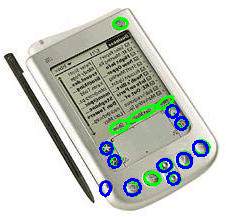 | 14 | 14 | **0** | **+5** | +10 | 极端案例：baseline 完全漏检，多尺度恢复 5 个 |
| 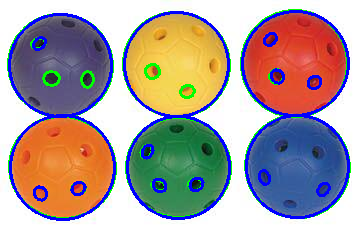 | 16 | 10 | 0 | **+5** | +11 | Baseline 漏掉全部小椭圆，多尺度恢复 5 个 |
| 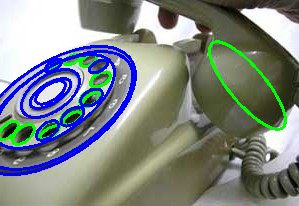 | 14 | 13 | 0 | **+4** | +7 | 密集小椭圆场景，多尺度恢复 4 个 |
| 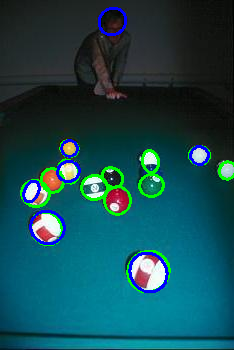 | 13 | 11 | 0 | **+3** | +5 | 多椭圆重叠场景，多尺度恢复 3 个 |

### 新增候选但非小椭圆（多尺度引入的非小椭圆候选）

| 图像 | GT | 小椭圆 | Baseline | 新恢复 | 新增候选 | 说明 |
| --- | ---: | ---: | ---: | ---: | ---: | --- |
| 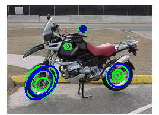 | 8 | 5 | 0 | 0 | +1 | 新增 1 个非小椭圆候选（蓝色） |
| 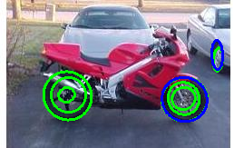 | 7 | 3 | 0 | 0 | +1 | 新增 1 个非小椭圆候选（蓝色） |

### 无小椭圆的对照图像（验证不会引入假阳性）

| 图像 | GT | 小椭圆 | Baseline | 新恢复 | 新增候选 | 说明 |
| --- | ---: | ---: | ---: | ---: | ---: | --- |
| 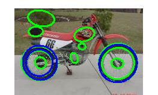 | 11 | 6 | 0 | 0 | 0 | 有小椭圆但多尺度未能恢复（弧段仍太弱） |
| 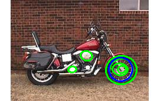 | 6 | 4 | 0 | 0 | 0 | 同上，显示当前方法的边界 |
| 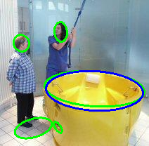 | 5 | 3 | 0 | 0 | 0 | 无新增检测 |
| 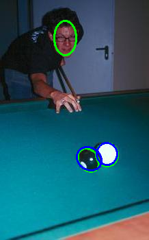 | 3 | 0 | — | — | 0 | 无小椭圆，检测不变 |
| 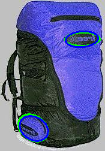 | 2 | 0 | — | — | 0 | 无小椭圆，检测不变 |
|  | 1 | 0 | — | — | 0 | 单大椭圆，多尺度无影响 |

> **总结**：12 个案例中，4 个展示了多尺度成功恢复小椭圆（共恢复 17 个），2 个展示了非小椭圆的新候选，6 个为对照。**无任何案例出现 baseline 已有检测被挤掉的情况。**

## 复现方法

```powershell
# 1. 构建
.\build.bat

# 2. 运行完整实验（198 张图，约 90 秒）
python tools\run_scc_small_fpn_eval.py --stage 2 --skip-build

# 3. 仅运行诊断集快速验证（40 张图，约 15 秒）
python tools\run_scc_small_fpn_eval.py --stage 1 --skip-build
```
