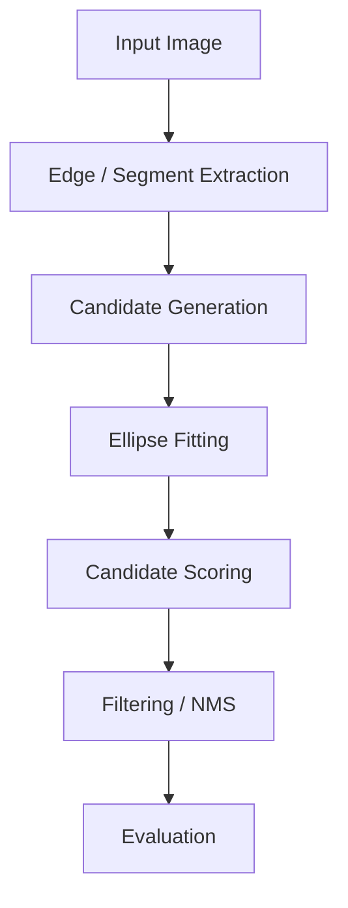
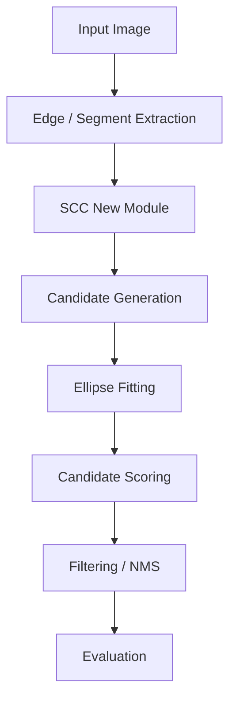

# classic-ellipse-detector 算法改进实验任务

## 0. 当前任务定位

你现在要在本地项目中完成一次**可复现、可合并、可验证**的算法改进实验。

项目路径：

```text
E:\scc_desk\Net\classic-ellipse-detector
```

数据路径：

```text
E:\scc_desk\Net\classic-ellipse-detector\datasets
```

文档输出路径：

```text
E:\scc_desk\Net\classic-ellipse-detector\scc_doc
```

当前 git 分支：

```text
scc
```

本次任务不是单纯调参，也不是直接重写成 CNN。
本次任务的核心目标是：

> 在传统椭圆检测算法中验证一个可模块化的改进点，并判断它是否适合未来迁移到 CNN / 深度学习模型中。

请优先考虑以下类型的改进：

1. 候选椭圆生成；
2. 弧段 / 边缘片段筛选；
3. 椭圆拟合前的候选质量控制；
4. 椭圆候选评分；
5. 后处理排序；
6. 几何一致性约束；
7. 可迁移到 CNN 的 lightweight module、loss、attention、gating 或 proposal filter。

不要优先尝试以下方向：

1. 直接重写整个检测器；
2. 直接引入大型 CNN；
3. 大规模修改已有核心代码；
4. 只做无解释的参数搜索；
5. 只追求文档漂亮但没有真实实验结果。

---

## 1. 总体原则

请严格遵守以下原则：

### 1.1 先理解项目，再修改代码

在正式修改代码之前，必须先完成项目侦察，并输出侦察报告。

不要一开始就写代码。

### 1.2 优先新增文件，减少合并冲突

当前分支为 `scc`，之后需要合并，所以请尽量：

1. 新增文件；
2. 新增实验脚本；
3. 新增 wrapper；
4. 新增文档；
5. 新增可视化输出目录；
6. 用参数开关控制新模块是否启用。

尽量不要直接修改已有核心文件。

如果必须修改已有文件，必须说明：

1. 修改了哪个文件；
2. 为什么必须修改；
3. 修改范围是什么；
4. 是否影响原始 baseline；
5. 如何恢复原状。

### 1.3 不允许编造结果

所有实验结果必须来自真实运行。

如果实验无法运行，必须如实记录：

1. 执行了什么命令；
2. 报错信息是什么；
3. 卡在哪一步；
4. 已完成了哪些部分；
5. 未完成哪些部分；
6. 下一步如何修复。

不要为了让报告完整而伪造 AP、Time、可视化图片或提升幅度。

---

## 2. 第一阶段：项目侦察，不修改代码

请先阅读项目结构，暂时不要修改任何代码。

需要查清楚以下内容：

### 2.1 项目结构

请输出项目目录摘要，重点找出：

1. 主程序入口；
2. baseline 运行方式；
3. 数据读取代码；
4. 椭圆检测主流程；
5. 评价脚本；
6. 可视化脚本；
7. 配置文件；
8. 结果输出目录；
9. 可以安全新增实验代码的位置。

### 2.2 baseline 算法流程

请根据代码实际情况，总结 baseline 的检测流程。

如果项目流程类似下面结构，请确认每一步对应的代码位置：

```text
图像输入
→ 边缘检测 / edge map
→ 边缘片段或弧段提取
→ 弧段组合 / 候选生成
→ 椭圆参数拟合
→ 候选椭圆评分
→ 候选筛选 / NMS
→ 输出检测结果
→ 评价 AP 和 Time
```

如果实际项目流程不同，请以代码为准，不要强行套用上述流程。

### 2.3 baseline 运行命令

请找出并记录 baseline 的真实运行命令。

如果项目有 README，请优先参考 README。
如果 README 过时，请结合代码和实际运行结果判断。

需要输出：

```text
baseline 运行命令：
baseline 输入路径：
baseline 输出路径：
baseline 评价命令：
baseline 结果文件：
```

### 2.4 数据集结构

请检查：

```text
E:\scc_desk\Net\classic-ellipse-detector\datasets
```

需要弄清楚：

1. 有哪些子数据集；
2. 图像文件在哪里；
3. 标注文件在哪里；
4. 标注格式是什么；
5. 是否有 train / val / test 划分；
6. 当前项目默认使用哪个数据集；
7. 评价脚本需要什么格式的输入。

如果数据集结构不清楚，请不要猜，直接在报告中说明不确定点。

### 2.5 侦察报告输出

请把第一阶段结果写入：

```text
E:\scc_desk\Net\classic-ellipse-detector\scc_doc\00_project_survey.md
```

文档必须包括：

1. 项目结构摘要；
2. baseline 运行命令；
3. 数据集结构；
4. 评价脚本位置；
5. baseline 算法流程；
6. 后续可以安全新增文件的位置；
7. 当前不确定的问题。

完成第一阶段后，先停止，不要继续大规模改代码。

---

## 3. 第二阶段：跑通 baseline

在提出改进 idea 之前，必须先跑通 baseline。

### 3.1 baseline 实验要求

请使用项目原始方法，在相同数据集上运行 baseline。

需要记录：

1. 运行命令；
2. 输入数据；
3. 输出文件；
4. AP 指标；
5. Time/ms；
6. 是否有可视化结果；
7. 是否出现报错。

### 3.2 指标要求

如果项目支持以下指标，请记录：

| 指标      | 方向     |
| --------- | -------- |
| AP_0.5    | 越高越好 |
| AP_0.75   | 越高越好 |
| AP10_0.5  | 越高越好 |
| AP10_0.75 | 越高越好 |
| Time/ms   | 越低越好 |

如果项目实际指标名称不同，请同时记录原始名称和解释。

### 3.3 baseline 结果输出

请把 baseline 结果写入：

```text
E:\scc_desk\Net\classic-ellipse-detector\scc_doc\01_baseline_result.md
```

必须包括：

1. baseline 命令；
2. 数据集名称；
3. 指标表格；
4. 运行时间；
5. 输出文件路径；
6. 可视化图片路径；
7. 失败样例，如果有；
8. 报错信息，如果有。

如果 baseline 都跑不通，请停止后续算法改进，优先分析为什么 baseline 跑不通。

---

## 4. 第三阶段：提出候选 idea

只有在完成项目侦察和 baseline 运行之后，才开始提出改进 idea。

请至少提出 3 个候选 idea。

每个 idea 必须说明：

1. 改的是流程中的哪个位置；
2. 输入是什么；
3. 输出是什么；
4. 预计提高精度还是速度；
5. 是否影响 baseline 原始流程；
6. 是否能通过新增文件实现；
7. 是否方便迁移到 CNN；
8. 实现成本；
9. 实验风险。

---

## 5. CNN 迁移性判断标准

每个 idea 必须按照下面标准评分。

| 维度         | 问题                                                    | 分数 |
| ------------ | ------------------------------------------------------- | ---- |
| 输入输出清晰 | 是否能明确写成 input → module → output                | 0-2  |
| 可微分潜力   | 是否能改造成 loss、soft score 或 differentiable module  | 0-2  |
| CNN 接口友好 | 是否可以接收 feature map、edge map、heatmap 或 proposal | 0-2  |
| 监督信号     | 是否能从 GT ellipse 自动生成训练标签                    | 0-2  |
| batch 化潜力 | 是否适合 GPU / batch 计算                               | 0-2  |
| 几何意义     | 是否保留明确的椭圆几何先验                              | 0-2  |
| 工程独立性   | 是否可以作为独立模块迁移                                | 0-2  |

满分 14 分。

评分解释：

```text
0 分：基本不适合迁移
1 分：理论上可以，但需要较大改造
2 分：非常适合迁移
```

优先选择 CNN 迁移性 ≥ 9 分的 idea。

---

## 6. idea 打分与优先级

请对每个候选 idea 按下面维度打分。

本次任务的权重如下：

| 维度         | 权重 |
| ------------ | ---: |
| 实现成本低   |  25% |
| 可合并性强   |  20% |
| CNN 迁移价值 |  20% |
| 精度提升潜力 |  15% |
| 速度提升潜力 |  10% |
| 实验风险低   |  10% |

注意：本次任务优先级不是“最大理论提升”，而是：

```text
低成本实现
+ 能真实跑实验
+ 方便合并
+ 未来能迁移 CNN
```

请输出一个候选 idea 排名表：

| 排名 | idea | 改进位置 | 预期收益 | 实现成本 | CNN 迁移分 | 风险 | 是否推荐 |
| ---- | ---- | -------- | -------- | -------- | ---------: | ---- | -------- |

最后只选择排名第一的 idea 进行实现。

不要同时实现多个 idea。

---

## 7. 第四阶段：最小实现

### 7.1 实现原则

请只实现排名第一的 idea 的最小可行版本。

要求：

1. 优先新增文件；
2. 尽量不修改原始 baseline；
3. 使用 wrapper 或参数开关调用新模块；
4. 保留原始 baseline 输出；
5. 新方法输出到单独目录；
6. 所有中间结果可追踪；
7. 所有命令可复现。

### 7.2 建议新增目录

可以使用如下结构：

```text
classic-ellipse-detector/
├── scc_experiments/
│   ├── run_baseline_scc.py
│   ├── run_scc_method.py
│   ├── scc_module.py
│   ├── eval_scc.py
│   └── visualize_scc.py
├── scc_doc/
│   ├── 00_project_survey.md
│   ├── 01_baseline_result.md
│   ├── 02_idea_selection.md
│   ├── 03_sanity_check.md
│   ├── 04_full_experiment.md
│   ├── 05_final_report.md
│   ├── figures/
│   └── logs/
```

如果项目语言不是 Python，请根据实际语言调整，但仍然保持：

1. 新增文件；
2. 独立实验目录；
3. 独立文档目录；
4. 独立日志目录。

---

## 8. 第五阶段：小规模 sanity check

在完整实验前，必须先做小规模 sanity check。

### 8.1 sanity check 数据规模

请从数据集中选择少量样本，例如：

```text
5 到 20 张图像
```

如果项目已有 debug / demo 数据，请优先使用。

### 8.2 sanity check 目标

sanity check 只验证：

1. 新模块能否运行；
2. 输入输出格式是否正确；
3. 是否能接入 baseline 流程；
4. 是否明显破坏检测结果；
5. 运行时间是否异常；
6. 是否能生成可视化结果。

### 8.3 sanity check 通过条件

满足以下条件才进入完整实验：

1. 程序能完整运行；
2. 输出格式能被评价脚本读取；
3. 至少生成部分检测结果；
4. 没有明显全空输出；
5. 没有明显耗时爆炸；
6. 可视化结果能正常保存。

如果 sanity check 失败，停止完整实验，并写失败分析。

### 8.4 sanity check 文档

请写入：

```text
E:\scc_desk\Net\classic-ellipse-detector\scc_doc\03_sanity_check.md
```

必须包括：

1. 测试样本数量；
2. 运行命令；
3. 结果路径；
4. 是否通过；
5. 可视化图片；
6. 报错信息；
7. 下一步建议。

---

## 9. 第六阶段：完整实验

只有 sanity check 通过后，才运行完整实验。

### 9.1 实验对比

必须对比：

1. baseline；
2. SCC 改进方法。

两者必须使用：

1. 相同数据；
2. 相同评价脚本；
3. 相同指标；
4. 相同硬件环境；
5. 尽量相同随机种子，如果有随机性。

### 9.2 结果表格

请输出如下表格：

| 方法       | AP_0.5 | AP_0.75 | AP10_0.5 | AP10_0.75 | Time/ms |
| ---------- | -----: | ------: | -------: | --------: | ------: |
| Baseline   |        |         |          |           |         |
| SCC-Method |        |         |          |           |         |
| Δ         |        |         |          |           |         |

如果实际指标不同，请使用项目真实指标，同时保留解释。

### 9.3 可视化要求

请至少保存：

1. baseline 检测结果图；
2. SCC 方法检测结果图；
3. 成功案例对比；
4. 失败案例对比；
5. 如果可能，保存新增模块的中间可视化。

例如：

```text
scc_doc/figures/baseline_case_001.png
scc_doc/figures/scc_case_001.png
scc_doc/figures/failure_case_001.png
```

### 9.4 完整实验文档

请写入：

```text
E:\scc_desk\Net\classic-ellipse-detector\scc_doc\04_full_experiment.md
```

必须包括：

1. 实验设置；
2. 数据集说明；
3. baseline 命令；
4. SCC 方法命令；
5. 指标表格；
6. 时间对比；
7. 可视化结果；
8. 成功案例；
9. 失败案例；
10. 初步结论。

---

## 10. 停止条件

为防止任务失控，请遵守以下停止条件。

### 10.1 baseline 失败

如果 baseline 跑不通，停止算法改进。

只完成：

1. 项目侦察；
2. baseline 失败分析；
3. 修复建议。

### 10.2 第一个 idea 失败

如果第一个 idea 的 sanity check 失败，可以尝试第二个 idea。

但是必须满足：

1. 第二个 idea 实现成本低；
2. 不需要大规模改代码；
3. 不需要新引入复杂依赖；
4. 不会覆盖第一个 idea 的结果。

### 10.3 最多尝试两个 idea

本轮最多尝试 2 个 idea。

如果两个 idea 都失败，停止继续写代码，转为失败分析。

### 10.4 不做无限调参

不要进行无边界参数搜索。

如果确实需要调参，最多尝试：

```text
3 组参数
```

并记录每组参数结果。

---

## 11. 最终报告

最终报告写入：

```text
E:\scc_desk\Net\classic-ellipse-detector\scc_doc\05_final_report.md
```

报告必须包括以下内容。

### 11.1 项目背景

说明当前项目 baseline 的实际流程。

必须包括一个流程图。

可以使用 Mermaid：



如果实际流程不同，请按实际代码修改流程图。

### 11.2 改进方法

说明 SCC 方法改了哪里。

必须给出改进后流程图，并明确标出新增模块。

示例：



流程图必须显示：

1. 新增模块位置；
2. 新增模块输入；
3. 新增模块输出；
4. 影响的是候选生成、拟合、评分、筛选还是后处理。

### 11.3 idea 来源

说明该 idea 来自：

1. 项目代码观察；
2. 传统椭圆检测经验；
3. 相关论文；
4. 实验失败案例；
5. 对 CNN 迁移的考虑。

如果没有真实阅读论文，不要假装引用论文。

### 11.4 CNN 迁移分析

必须回答：

1. 这个模块能否变成 CNN 的 loss？
2. 能否变成 attention / gating？
3. 能否变成 proposal filter？
4. 输入是否可以从 edge map / feature map 得到？
5. 输出是否可以监督？
6. 是否适合 batch 化？
7. 是否保留椭圆几何先验？
8. 是否值得以后迁移到深度学习模型？

并给出 CNN 迁移性评分表。

### 11.5 实验结果

必须包括：

1. baseline 结果；
2. SCC 方法结果；
3. 指标差值；
4. 时间差值；
5. 成功案例；
6. 失败案例；
7. 是否有提升；
8. 提升或下降原因。

### 11.6 文件变更

必须列出：

#### 新增文件

```text
新增文件：
1.
2.
3.
```

#### 修改文件

```text
修改文件：
1.
2.
3.
```

如果没有修改已有文件，请写：

```text
未修改已有核心文件。
```

### 11.7 运行命令

必须列出完整运行命令：

```text
baseline:
...

SCC method:
...

evaluation:
...
```

### 11.8 最终结论

请明确给出：

1. 本次实验是否成功；
2. 精度是否提升；
3. 速度是否提升；
4. 是否值得继续；
5. 是否适合迁移 CNN；
6. 下一轮最建议做什么。

---

## 12. 最终输出给用户的摘要

完成任务后，请在终端最终回复中给出简洁摘要：

```text
任务完成情况：
- 项目侦察：完成 / 未完成
- baseline：跑通 / 未跑通
- 改进 idea：已实现 / 未实现
- sanity check：通过 / 未通过
- 完整实验：完成 / 未完成
- 文档路径：...
- 新增文件：...
- 修改文件：...
- 主要结果：...
- 是否建议继续：...
```

---

## 13. 重要限制

请始终遵守：

1. 不编造实验结果；
2. 不编造论文引用；
3. 不覆盖 baseline 结果；
4. 不大规模重写项目；
5. 不一次实现多个 idea；
6. 不无限调参；
7. 不把失败包装成成功；
8. 不忽略报错；
9. 不在没有 baseline 的情况下声称方法有效；
10. 不牺牲可合并性换取短期结果。

本任务的优先级顺序是：

```text
可运行
> 可复现
> 可合并
> 可解释
> 可迁移 CNN
> 指标提升
```

如果指标没有提升，但实验真实、分析清楚、模块可迁移，也算有价值的研究结果。
