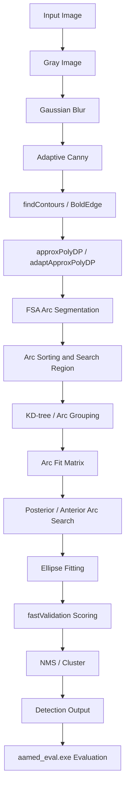
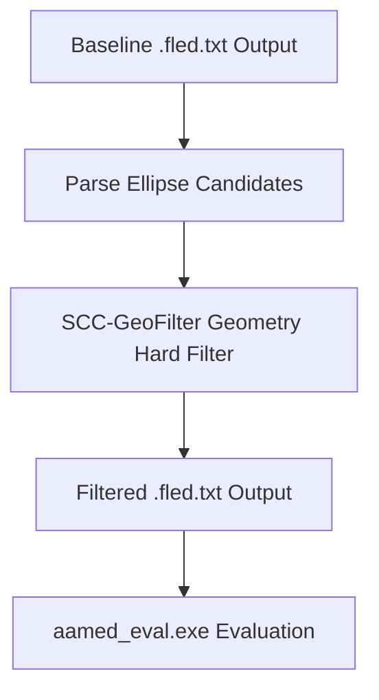

# SCC-GeoFilter 最终报告

生成时间：2026-05-30

## 1. baseline 流程简述

当前项目是 C++17 / OpenCV 版本的 AAMED 椭圆检测 baseline。baseline detector 内部流程如下：



本轮没有改写 detector 内部流程。

## 2. SCC-GeoFilter 改进位置

SCC-GeoFilter 是后处理模块，作用在 baseline 已输出的 `.fled.txt` 文件之后：



它不是 detector 内部重写，也不修改 `src/FLED.cpp`、`src/Group.cpp`、`src/Segmentation.cpp`。

## 3. 方法说明

SCC-GeoFilter 读取 `datasets\prasad\AAMED` 中的 baseline `.fled.txt` 文件。每个文件首行是 detector 耗时，后续每行为一个椭圆候选。模块保留首行耗时，只删除不满足几何规则的候选行。

使用的几何规则：

1. 轴长必须为正。
2. 长短轴比例不能过大。
3. 椭圆面积相对图像面积不能过小或过大。
4. 中心点不能明显超出图像边界。
5. 旋转椭圆外接盒不能明显超出图像边界。

因为 `.fled.txt` 中没有 score，本轮没有做 score 阈值或 score re-ranking。

## 4. 最佳参数组

按最高 FMeasure 选择：

```text
SCC-Strict
```

参数：

| 参数 | 数值 |
| --- | ---: |
| max_axis_ratio | 4.0 |
| min_area_ratio | 0.0010 |
| max_area_ratio | 0.85 |
| center_margin_ratio | 0.00 |
| bbox_margin_ratio | 0.10 |

## 5. baseline 与最佳 SCC 对比

| 方法 | Precision | Recall | FMeasure | AverageDetectedTimeMs |
| --- | ---: | ---: | ---: | ---: |
| Baseline | 0.771285 | 0.396567 | 0.523810 | 5.146824 |
| SCC-Strict | 0.776094 | 0.395708 | 0.524161 | 5.146824 |

差值：

| 指标 | 差值 |
| --- | ---: |
| ΔPrecision | +0.004809 |
| ΔRecall | -0.000859 |
| ΔFMeasure | +0.000351 |
| ΔAverageDetectedTimeMs | +0.000000 |

完整三组结果：

| 方法 | Precision | Recall | FMeasure | AverageDetectedTimeMs |
| --- | ---: | ---: | ---: | ---: |
| Baseline | 0.771285 | 0.396567 | 0.523810 | 5.146824 |
| SCC-Loose | 0.772575 | 0.396567 | 0.524107 | 5.146824 |
| SCC-Medium | 0.772575 | 0.396567 | 0.524107 | 5.146824 |
| SCC-Strict | 0.776094 | 0.395708 | 0.524161 | 5.146824 |

## 6. 是否提升

| 问题 | 结论 |
| --- | --- |
| 是否提升 Precision | 是，最佳组 +0.004809 |
| 是否提升 Recall | 否，最佳组 -0.000859 |
| 是否提升 FMeasure | 是，但幅度很小，+0.000351 |
| 是否影响 AverageDetectedTimeMs | 评估值无变化；SCC 后处理耗时另计 |
| 是否降低 detector time | 否；该模块不重跑 detector，也不改写首行耗时 |

SCC-GeoFilter 后处理总耗时为 3 组参数共 1157.212 ms。该耗时没有写入 `.fled.txt` 首行，也没有混入 `AverageDetectedTimeMs`。

## 7. 成功与失败原因分析

成功点：

- 模块独立，未修改核心 C++ detector。
- 输出格式兼容 `aamed_eval.exe`。
- 三组参数都能在 198 张 Prasad 图像上完整运行。
- Precision 和 FMeasure 有真实、可复现的小幅提升。

限制与失败点：

- hard filter 删除候选很少，最佳组只删除 5 / 584 个候选。
- strict 组虽然 Precision 更高，但减少了 1 个 PositiveMatch，导致 Recall 下降。
- 规则只依赖最终椭圆几何参数，无法使用弧段支持度、边缘一致性或 validation score。
- FMeasure 提升很小，不能说明该 hard filter 是强有效改进。

结论：SCC-GeoFilter 作为 hard post-filter 有一定价值，但收益有限。更有潜力的下一步是 soft score / re-ranking，而不是继续加严 hard threshold。

## 8. CNN 迁移性分析

| 维度 | 评分 0-2 | 理由 |
| --- | ---: | --- |
| 输入输出清晰 | 2 | 输入 ellipse candidates，输出保留标记或质量分数 |
| 可微分潜力 | 1 | 当前是 hard filter；可改造成 soft geometry penalty |
| CNN 接口友好 | 2 | 可作用于 CNN candidate head 输出的椭圆候选 |
| 监督信号可构造 | 2 | 可由 GT ellipse 和候选 IoU 自动生成正负标签 |
| batch 化潜力 | 1 | 候选数量可变，需要 top-k、padding 或 mask |
| 几何意义明确 | 2 | 规则保留椭圆轴比、面积、边界等先验 |
| 工程独立性 | 2 | 当前已作为独立后处理模块实现 |
| 总分 /14 | 12 | 适合迁移，但建议迁移为 soft score |

迁移判断：

1. 可以变成 geometry loss，但应使用连续 penalty，而不是硬删除。
2. 可以变成 proposal filtering。
3. 可以变成 confidence calibration。
4. 可以作用于 CNN 输出的 ellipse candidates。
5. 输入可来自 candidate head；若需要更强效果，可结合 edge map 或 feature map。
6. 输出可以作为 soft score。
7. batch 化可行，但需要固定 top-k 或 padding。
8. 保留了明确的椭圆几何先验。

## 9. 文件变更

新增文件：

```text
scc_experiments/scc_geofilter.py
scc_experiments/run_scc_geofilter_prasad.py
scc_doc/round_01_geofilter/03_full_experiment.md
scc_doc/round_01_geofilter/04_final_report.md
scc_doc/logs/round_01_geofilter/scc_geofilter_commands.txt
scc_doc/logs/round_01_geofilter/scc_geofilter_eval_results.txt
scc_doc/logs/round_01_geofilter/scc_geofilter_prasad_summary.json
```

新增输出目录 / 文件：

```text
output/scc_geofilter_prasad_loose
output/scc_geofilter_prasad_medium
output/scc_geofilter_prasad_strict
output/prasad_official_aamed_eval_result.txt
output/scc_geofilter_prasad_loose_eval_result.txt
output/scc_geofilter_prasad_medium_eval_result.txt
output/scc_geofilter_prasad_strict_eval_result.txt
```

修改文件：

```text
未修改已有 C++ 核心 detector 文件。
```

## 10. 关键结果路径

| 内容 | 路径 |
| --- | --- |
| 实验记录 | `scc_doc\round_01_geofilter\03_full_experiment.md` |
| 最终报告 | `scc_doc\round_01_geofilter\04_final_report.md` |
| 命令日志 | `scc_doc\logs\round_01_geofilter\scc_geofilter_commands.txt` |
| 评估日志 | `scc_doc\logs\round_01_geofilter\scc_geofilter_eval_results.txt` |
| SCC 汇总 JSON | `scc_doc\logs\round_01_geofilter\scc_geofilter_prasad_summary.json` |
| 最佳 SCC 输出 | `output\scc_geofilter_prasad_strict` |
| 最佳 SCC 评估报告 | `output\scc_geofilter_prasad_strict_eval_result.txt` |

## 11. 后续建议

建议继续这个方向，但不要继续扩大 hard filter。下一轮优先尝试：

```text
SCC-GeoScore / soft re-ranking
```

候选方案：

1. 将轴比、面积、边界越界程度变成连续 soft penalty。
2. 不删除候选，而是重排候选或校准 confidence。
3. 若可以从 detector 中导出中间信息，加入弧段支持度或边缘覆盖率。
4. 未来迁移到 CNN 时，将该模块设计为 candidate-level geometry score head 或 geometry-aware loss。
