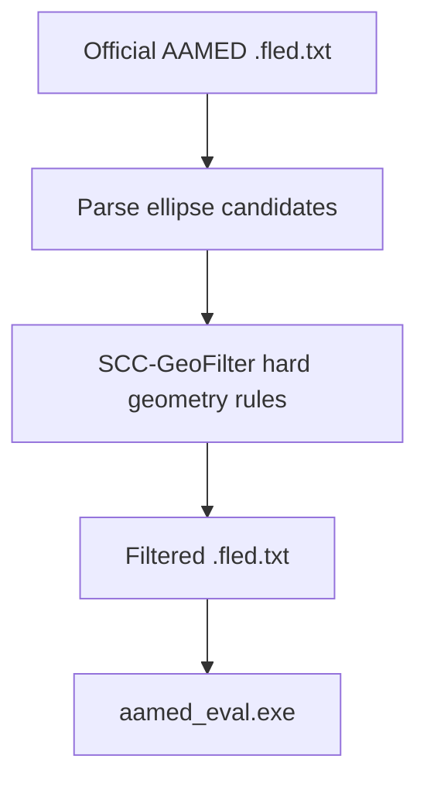

# classic-ellipse-detector Consolidated Final Report

生成时间：2026-05-30

## 1. 当前状态

当前工作分支：

```text
scc
```

分支检查结论：

- `main`、`scc`、`deepseek` 当前指向同一个初始提交。
- `deepseek` 中看到的实验内容主要来自未提交工作区文件。
- 已切换到 `scc` 分支，并将当前工作区内容统一整理到 `scc` 分支下。
- 未执行 `git push`。

## 2. 原始数据与 baseline

保留原始数据：

```text
data/
datasets/README.md
datasets/prasad/imagenames.txt
datasets/prasad/images/
datasets/prasad/gt/
datasets/prasad/AAMED/
```

`datasets/prasad/AAMED/` 是官方 / baseline `.fled.txt` 输出目录，未覆盖。

Official AAMED baseline 评估：

```text
Images: 198
PositiveMatches: 462
DetectedCount: 599
GroundTruthCount: 1165
Precision: 0.771285
Recall: 0.396567
FMeasure: 0.523810
AverageDetectedTimeMs: 5.146824
```

## 3. 尝试 1：SCC-GeoFilter

SCC-GeoFilter 是独立后处理模块，不修改 detector。流程：



规则：

1. 轴长必须为正。
2. 轴比不能异常。
3. 面积比例不能过小或过大。
4. 中心不能明显越界。
5. 旋转外接框不能明显越界。

结果：

| 方法 | Precision | Recall | FMeasure | AverageDetectedTimeMs |
| --- | ---: | ---: | ---: | ---: |
| Official AAMED baseline | 0.771285 | 0.396567 | 0.523810 | 5.146824 |
| SCC-GeoFilter loose | 0.772575 | 0.396567 | 0.524107 | 5.146824 |
| SCC-GeoFilter medium | 0.772575 | 0.396567 | 0.524107 | 5.146824 |
| SCC-GeoFilter strict | 0.776094 | 0.395708 | 0.524161 | 5.146824 |

结论：

- 最佳组为 `strict`。
- Precision 提升 `+0.004809`。
- Recall 下降 `-0.000859`。
- FMeasure 小幅提升 `+0.000351`。
- 该方向可保留，但下一步更适合做 soft score / re-ranking，而不是继续加严 hard filter。

详细文档：

```text
scc_doc/attempts/01_scc_geofilter.md
```

## 4. 尝试 2：Fixed Baseline and SCC-Enhance

该尝试包含两个部分：

1. 修复 `src/Group.cpp` 中 `BiDirectionVerification` 的 `isCombValid` 状态污染问题。
2. 在 fixed detector 前尝试 CLAHE + bilateral filter 图像预处理。

核心修复：

```text
将 isCombValid 从 fitComb 循环外移动到每个候选循环内部初始化。
```

原因：

- 原始写法中，一旦某个组合把 `isCombValid` 置为 false，后续组合可能继承错误状态。
- 修复后每个候选组合独立验证。

Fixed detector baseline 结果：

```text
Images: 198
PositiveMatches: 469
DetectedCount: 602
GroundTruthCount: 1165
Precision: 0.779070
Recall: 0.402575
FMeasure: 0.530843
AverageDetectedTimeMs: 14.952466
```

SCC-Enhance 预处理结果：

| 方法 | Precision | Recall | FMeasure | AverageDetectedTimeMs |
| --- | ---: | ---: | ---: | ---: |
| Fixed detector baseline | 0.779070 | 0.402575 | 0.530843 | 14.952466 |
| SCC-Enhance light | 0.728296 | 0.388841 | 0.506995 | 15.036036 |
| SCC-Enhance medium | 0.727119 | 0.368240 | 0.488889 | 17.242711 |
| SCC-Enhance strong | 0.783985 | 0.361373 | 0.494712 | 15.353225 |

结论：

- `Group.cpp` bugfix 是当前最有价值的改动，FMeasure 相对 official baseline 提升 `+0.007033`。
- SCC-Enhance 三组均低于 fixed detector baseline，不推荐继续这条 hard-coded 外部预处理路线。
- strong 组 Precision 较高，但 Recall 明显下降，FMeasure 不理想。

详细文档：

```text
scc_doc/attempts/02_scc_enhance.md
```

## 5. 总指标表

| 方法 | Precision | Recall | FMeasure | AverageDetectedTimeMs | 说明 |
| --- | ---: | ---: | ---: | ---: | --- |
| Official AAMED baseline | 0.771285 | 0.396567 | 0.523810 | 5.146824 | 原始结果 |
| SCC-GeoFilter strict | 0.776094 | 0.395708 | 0.524161 | 5.146824 | 最佳后处理 |
| Fixed detector baseline | 0.779070 | 0.402575 | 0.530843 | 14.952466 | `Group.cpp` bugfix |
| SCC-Enhance light | 0.728296 | 0.388841 | 0.506995 | 15.036036 | 预处理 |
| SCC-Enhance medium | 0.727119 | 0.368240 | 0.488889 | 17.242711 | 预处理 |
| SCC-Enhance strong | 0.783985 | 0.361373 | 0.494712 | 15.353225 | 预处理 |

机器可读表：

```text
scc_doc/tables/metrics_summary.csv
```

## 6. 可视化

已保留清晰案例图：

```text
scc_doc/figures/baseline_case_001.png
scc_doc/figures/scc_case_001.png
scc_doc/figures/success_case_001.png
scc_doc/figures/failure_case_001.png
```

说明：

- 这些图来自 SCC-GeoFilter strict 的候选减少案例。
- 红色为 baseline，绿色为 SCC 输出。
- 不编造逐例 IoU 结论，只作为候选变化可视化。

## 7. 文件结构

核心实验脚本：

```text
scc_experiments/
  README.md
  scc_geofilter.py
  run_scc_geofilter_prasad.py
  run_scc_geofilter_sanity.py
  visualize_scc_cases.ps1
  scc_enhance.py
  run_fixed_baseline.py
  run_scc_enhance.py
  run_scc_enhance_sanity.py
```

文档结构：

```text
scc_doc/
  experiment_index.md
  common/
    00_project_survey.md
    01_baseline_result.md
  round_01_geofilter/
    03_full_experiment.md
    04_final_report.md
  round_02_fixed_enhance/
    02_idea_selection.md
    03_sanity_check.md
    04_full_experiment.md
    05_consolidated_final_report.md
  attempts/
    01_scc_geofilter.md
    02_scc_enhance.md
  figures/
  logs/
    common/
    round_01_geofilter/
    round_02_fixed_enhance/
  tables/
```

## 8. 清理策略

保留：

- 原始数据。
- detector 输出 `.fled.txt`。
- 评估 `.txt`。
- 汇总 `.json`。
- 可视化 `.png`。
- 实验脚本和文档。

清理：

- 根目录 `*.obj`。
- `scc_experiments/__pycache__/`。
- `output/scc_enhance_*_images/`。
- `datasets/prasad/AAMED_backup/`。

## 9. 最终结论

本轮统一整理后，建议主线保留：

```text
src/Group.cpp isCombValid bugfix
```

次要可保留方向：

```text
SCC-GeoFilter -> 下一轮改成 soft score / re-ranking
```

不建议继续：

```text
当前 SCC-Enhance 外部 CLAHE + bilateral hard-coded 预处理
```

下一轮最建议：

```text
在保留 Group.cpp bugfix 的基础上，做 SCC-GeoScore：候选级 soft geometry scoring / confidence calibration。
```
